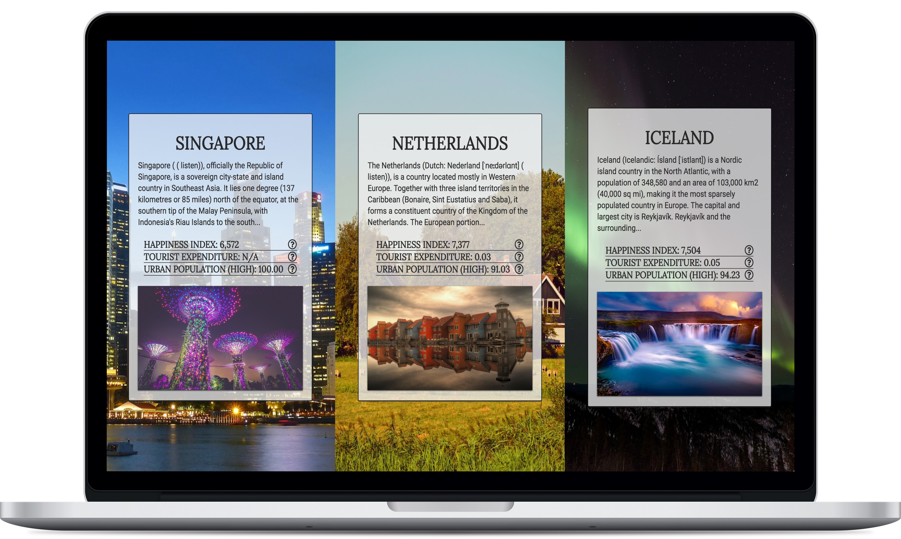

# Horizons
Horizons is a web application that provides users with three curated travel recommendations.

It calculates this based on the user's purpose of travel and their ranking of specific socioeconomic criteria (252 possible outcomes), using min/max heap data structures.

The data is drawn from the INQstats API, with Wikipedia and Pixabay as secondary APIs.

## Live Link
NOTE: the **INQstats API is unfortunately offline** since mid-late 2018. This app is unfortunately no longer functional.

## Screenshot

